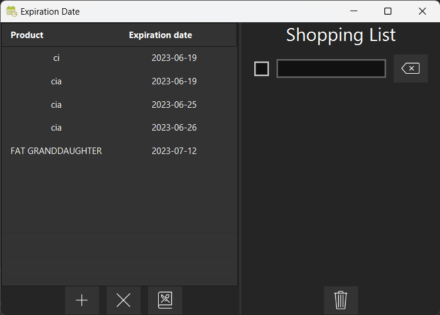
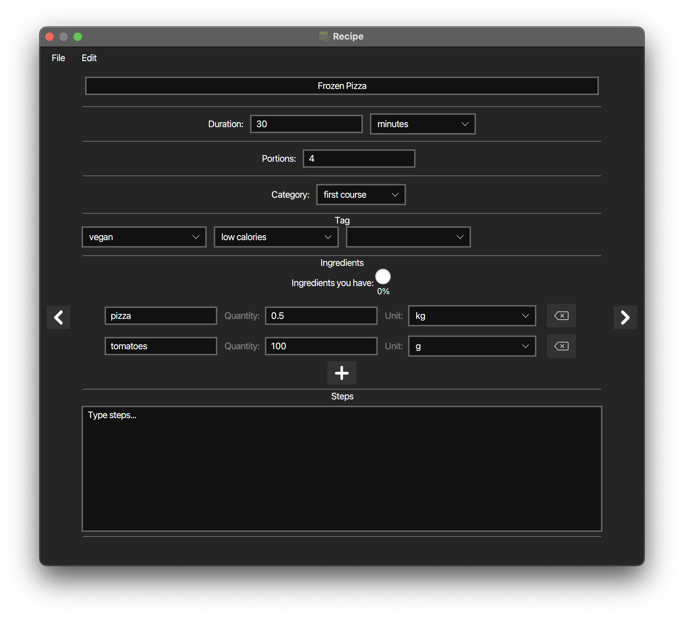
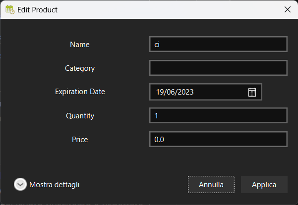

This application was designed to help people manage their food-related issues.

# Table of contents
- [Overview](README.md#overview)
- [Features](README.md#features)
- [Credits](README.md#credits)

# Overview
The application consists of 2 main views:

|                Main view                 |
|:-------------------------------------------------------------------------------------:|
| On the right you can manage the shopping list, on the left you can manage your pantry. |

| The recipe view  |
| :---: |
| In this view you can write and edit your own recipes and see which products needed for the recipe are already in your pantry. |

# Features
- Shopping list
	- Add, remove, edit products in the shopping list
	- Mark products as bought and automatically add them to the pantry list
	- You can clear the bought products by clicking on the bin icon at the bottom
- Pantry list
	- Add, remove, edit products with their name and expiration date
		- You can edit the name by double-clicking on its field
		- If you double-click the date, you can edit the product's details through a dedicated view 
	- Products are stored on a database, so data will not be lost when you close the application!
	- When you add, edit or delete a product, it is mirrored also on your personal calendar. In this way you will be notified when a product is expiring
- Recipe window
	- you can swipe from a recipe to another one
	- you can view and edit the recipe. Each recipe has these fields
		- Title (this must be unique)
		- Duration (can be expressed in minutes or hours)
		- Portions
		- Category
		- Tag
		- Ingredients (you can see how many products you already have in your pantry)
		- Steps
	- auto-save feature
	- Import and export recipes

# Credits
- UI: [JavaFX](https://openjfx.io/) and [Scene Builder](https://gluonhq.com/products/scene-builder/)
- Calendar integration: [biweekly](https://github.com/mangstadt/biweekly)
- JSON import/export: [jackson-core](https://github.com/FasterXML/jackson-core), [jackson-databind](https://github.com/FasterXML/jackson-annotations), [jackson-datatype](https://github.com/FasterXML/jackson-databind)
- Database: [MySQL](https://www.mysql.com/), [HikariCP](https://mvnrepository.com/artifact/com.zaxxer/HikariCP)
- Icons: [icons8](https://icons8.com), [the noun project](https://thenounproject.com)
	- Calendar by David Khai from <a href="https://thenounproject.com/browse/icons/term/calendar/" target="_blank" title="Calendar Icons">Noun Project</a>
 	- add by Jony from <a href="https://thenounproject.com/browse/icons/term/add/" target="_blank" title="add Icons">Noun Project</a>
  	- Arrow by Alice Design from <a href="https://thenounproject.com/browse/icons/term/arrow/" target="_blank" title="Arrow Icons">Noun Project</a>
   	- Alert by Nursila from <a href="https://thenounproject.com/browse/icons/term/alert/" target="_blank" title="Alert Icons">Noun Project</a>
	- Delete by Landan Lloyd from <a href="https://thenounproject.com/browse/icons/term/delete/" target="_blank" title="Delete Icons">Noun Project</a>
	- bin by Alice Design from <a href="https://thenounproject.com/browse/icons/term/bin/" target="_blank" title="bin Icons">Noun Project</a>
  	- Cross by AliWijaya from <a href="https://thenounproject.com/browse/icons/term/cross/" target="_blank" title="Cross Icons">Noun Project</a>
	- add by AliWijaya from <a href="https://thenounproject.com/browse/icons/term/add/" target="_blank" title="add Icons">Noun Project</a>
