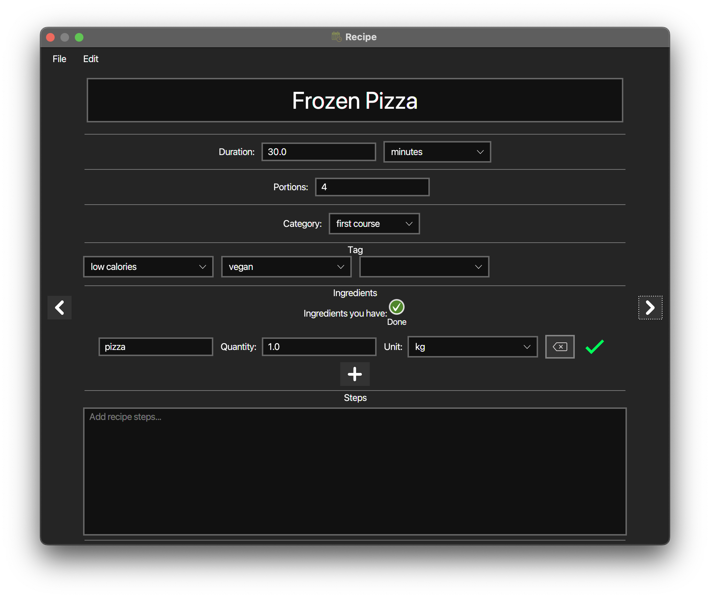
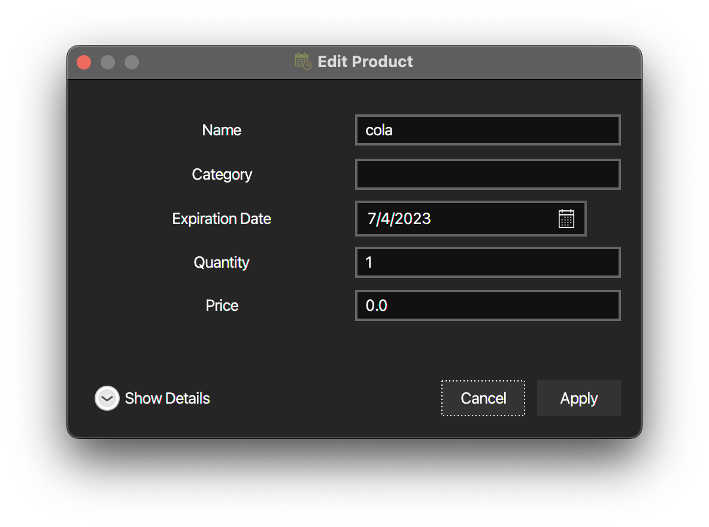

This application was designed to help people managing their food related issues. If you find this useful star the project!

# Table of contents
- [Overview](README.md#overview)
- [Features](README.md#features)
- [Credits](README.md#credits)

# Overview
The application consists in 2 main views:

|                Main view                 |
|:-------------------------------------------------------------------------------------:|
| On the right you can manage the shopping list, on the left you can manage your pantry |

| The recipe view  |
| :---: |
| In this view you can write and edit recipes and see which products needed for the recipe are already available. |

# Features
- Shopping list
	- Add, remove, edit items in shopping list
	- Mark products as bought and automatically add to the pantry list
	- You can clear the already taken items clicking on the bin icon on the bottom
- Pantry list
	- Add, remove, edit products with their name and expiration date
		- You can edit the name by double clicking on its field
		- If you double click the date you can edit the product's details through this view 
	- Items are stored on a database, so data will not be lost after you close the application!
	- When you add, edit or delete a product it is mirrored also on your personal calendar, in this way you will be notified when a product is expiring
- Recipe window
	- you can swipe from a recipe to another one
	- you can view and edit the recipe. Each recipe has these fields
		- Title (this must be unique)
		- Duration (can be expressed in minutes or hours)
		- Portions
		- Category
		- Tag
		- Ingredients (you can see how many products you already have in your pantry)
		- Steps
	- auto-save feature
	- Import and export recipes

# Credits
- UI: [JavaFX](https://openjfx.io/) and [Scene Builder](https://gluonhq.com/products/scene-builder/)
- Calendar integration: [biweekly](https://github.com/mangstadt/biweekly)
- JSON import/export: [jackson-core](https://github.com/FasterXML/jackson-core), [jackson-databind](https://github.com/FasterXML/jackson-annotations), [jackson-datatype](https://github.com/FasterXML/jackson-databind)
- Database: [MySQL](https://www.mysql.com/), [HikariCP](https://mvnrepository.com/artifact/com.zaxxer/HikariCP)